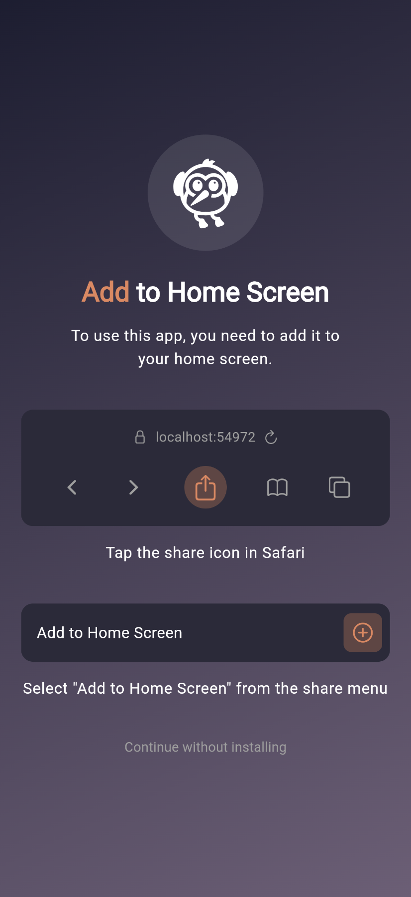
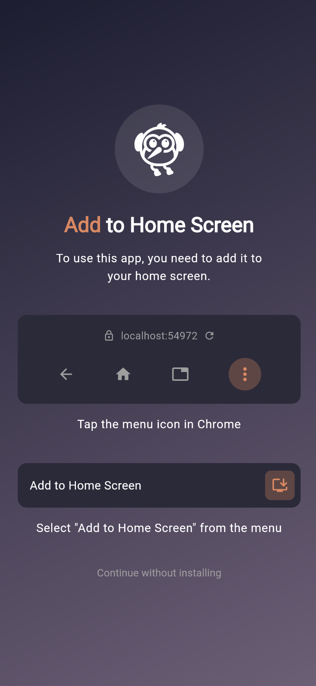
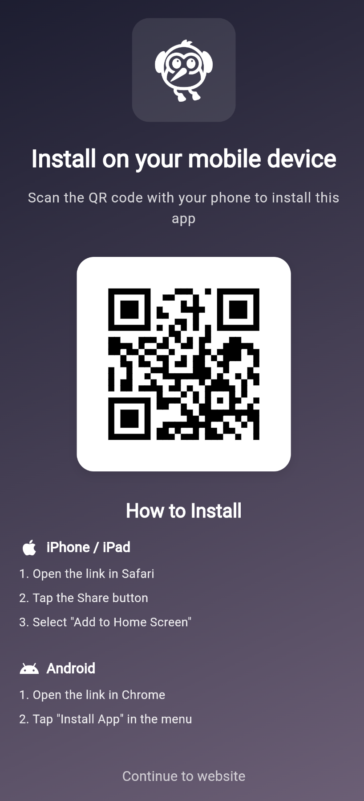
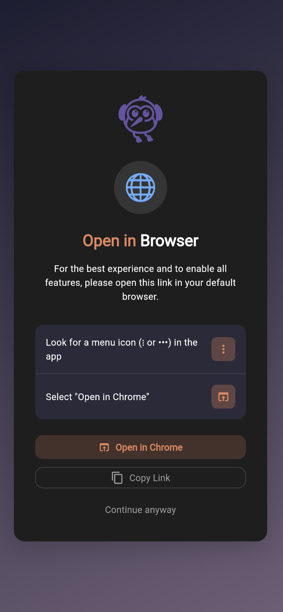

# pwa_installer

[](https://pub.dev/packages/pwa_installer)
[](https://flutter.dev/web)
[](https://opensource.org/licenses/MIT)

A Flutter package to facilitate PWA installation on the web. Provides install guides for iOS/Android, handles in-app browser detection, and intercepts install prompts for custom UI.

## Features

This package is useful when you want to force your user to use your web app in PWA mode, given them the best experience possible. You can also be less restrictive by simply notify instead of forcing.

Depends on the browser that open your PWA url:

- **Desktop Support**: Displays a QR code for users to scan.
- **iOS Support**: Displays a step-by-step visual guide for "Add to Home Screen" on Safari.
- **Android Support**: Trigger the native install prompt and displays a step-by-step visual guide.
- **In-App Browser Detection**: Redirects users when app is opened in an in-app browser (e.g., Instagram, Facebook). It will force to open in the default browser avoid potential issues with the PWA installation.
- **Customization**: Fully customizable text, colors, and UI overrides.

## Platform Support

| Feature       | iOS (Safari) | Android (Chrome) | Desktop | In-App Browsers |
| ------------- | ------------ | ---------------- | ------- | --------------- |
| Install Guide | ✅           | ✅               | N/A     | N/A             |
| Native Prompt | N/A          | ✅               | ✅      | N/A             |
| Redirect      | N/A          | N/A              | N/A     | ✅              |

## Screenshots

|             iOS Safari              |               Android Chrome                |                Desktop                 |              In-App Browser               |
| :---------------------------------: | :-----------------------------------------: | :------------------------------------: | :---------------------------------------: |
|  |  |  |  |

## Installation

Add `pwa_installer` to your `pubspec.yaml`:

```yaml
dependencies:
  pwa_installer: ^0.1.0
```

## Setup

To enable the custom install prompt on Android, add the following script to your `web/index.html` **before** the `flutter_bootstrap.js` script:

```html
<script>
  window.addEventListener("beforeinstallprompt", function (e) {
    window.__pwaInstallPrompt = e;
  });
</script>
<script src="flutter_bootstrap.js" async></script>
```

## Usage

Initialize the package in `main` and wrap your app with `PwaInstaller`:

```dart
import 'package:pwa_installer/pwa_installer.dart';

void main() {
  PwaInstaller.init();
  runApp(const MyApp());
}

class MyApp extends StatelessWidget {
  const MyApp({super.key});

  @override
  Widget build(BuildContext context) {
    return MaterialApp(
      home: PwaInstaller(
        appName: 'My App',
        logo: Image.asset('assets/logo.png', height: 80),
        child: const MyHomePage(),
      ),
    );
  }
}
```

## Configuration

### Disable Specific Features

You can disable features globally during initialization:

```dart
void main() {
  PwaInstaller.init(
    enableBrowserRedirect: true,      // In-app browser redirection
    enableMobileInstallGuide: true,   // display iOS/Android install guide
    enableDesktopInstallGuide: false, // disable QR code view when open url on browser desktop
    forceInstall: false,              // false let user continue on browser
  );
  runApp(const MyApp());
}
```

### Custom theme

```dart
@override
Widget build(BuildContext context) {
  return MaterialApp(
    home: PwaInstaller(
      appName: 'My App',
      logo: Image.asset('assets/logo.png'),
      theme: PwaInstallerTheme(
        accentColor: Colors.blue,
        backgroundColor: Color(0xFF1A1A2E),
        backgroundGradient: LinearGradient(
          colors: [Color(0xFF1A1D32), Color(0xFF725D78)],
        ),
      ),
      child: const MyHomePage(),
    ),
  );
}
```

Built-in themes: `PwaInstallerTheme.defaultTheme`, `PwaInstallerTheme.lightTheme`, `PwaInstallerTheme.fromContext(context)`

### Localization

```dart
@override
Widget build(BuildContext context) {
  return MaterialApp(
    home: PwaInstaller(
      appName: 'My App',
      logo: Image.asset('assets/logo.png'),
      labels: PwaInstallerLabels(
        titleAdd: 'Ajouter ',
        titleToHomeScreen: "à l'écran d'accueil",
        iosStep1: 'Appuyez sur le bouton de partage',
        iosStep2: 'Sélectionnez "Sur l\'écran d\'accueil"',
        androidStep1: 'Appuyez sur le menu',
        androidStep2: 'Sélectionnez "Installer"',
      ),
      child: const MyHomePage(),
    ),
  );
}
```

### Custom screen overrides

If you want to fully customize any install screen, you can override it with your own branded UI:

```dart
@override
Widget build(BuildContext context) {
  return MaterialApp(
    home: PwaInstaller(
      appName: 'My App',
      logo: Image.asset('assets/logo.png'),
      customBrowserRedirectScreen: (context, onDismiss) => MyCustomRedirectScreen(
        onContinue: onDismiss,
      ),
      customMobileScreen: (context, onDismiss) => MyCustomMobileGuide(
        onSkip: onDismiss,
      ),
      customDesktopScreen: (context, onDismiss) => MyCustomDesktopGuide(
        onDismiss: onDismiss,
      ),
      child: const MyHomePage(),
    ),
  );
}
```


## How Android Install Prompt Works

On Android (Chrome and Chromium-based browsers), the browser can trigger a native install prompt via the `beforeinstallprompt` event. This allows your PWA to be installed directly to the home screen just by tapping a button.

The `beforeinstallprompt` event is fired when:
1. The page meets the installability criteria
2. The user hasn't dismissed the prompt before
3. The PWA isn't already installed

### Requirements for Install Prompt

For the `beforeinstallprompt` event to fire, your PWA must meet **all** of these criteria:

1. **HTML Setup** in `web/index.html`:
   ```html
   <link rel="manifest" href="manifest.json">
   <meta name="theme-color" content="#0175C2"> <!-- Optional but recommended -->
   ```

2. **HTTPS**: The app must be served over a secure connection (or `localhost` for development).

3. **Valid Web App Manifest** (`manifest.json`) with:
   - `name` or `short_name`
   - `icons` (at least 192x192 and 512x512 PNG icons)
   - `start_url`
   - `display` set to `standalone`, `fullscreen`, or `minimal-ui`

4. **Service Worker**: A registered service worker with a `fetch` event handler.

5. **Not Already Installed**: The PWA must not already be installed on the device.

6. **User Engagement**: The user must have interacted with the domain for a minimum amount of time (varies by browser).

### Richer Install UI

Chrome supports a richer installation experience with screenshots and promotional content in your manifest:
👉 [Richer PWA Installation](https://developer.chrome.com/blog/richer-pwa-installation)

## Troubleshooting

### Install prompt not appearing on Android

1. Verify `<link rel="manifest" href="manifest.json">` is in your `web/index.html` `<head>`.
2. Ensure the setup script in `web/index.html` is placed **before** `flutter_bootstrap.js`.
3. Check your `manifest.json` includes all required fields (`name`, `icons`, `start_url`, `display`).
4. Verify a service worker is registered with a `fetch` handler.
5. Confirm the app is served over HTTPS (or `localhost`).
6. Open **DevTools → Application → Manifest** to check for installability errors.

### iOS users not seeing install guide

- Ensure the user is using Safari. Chrome on iOS does not support PWA installation.
## Support

If this package helps you, consider supporting its development:

<a href="https://www.buymeacoffee.com/shinob" target="_blank"></a>

## License

MIT License - see the [LICENSE](LICENSE) file for details.
